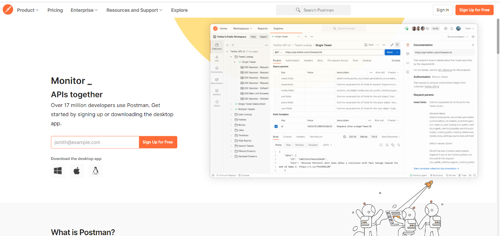
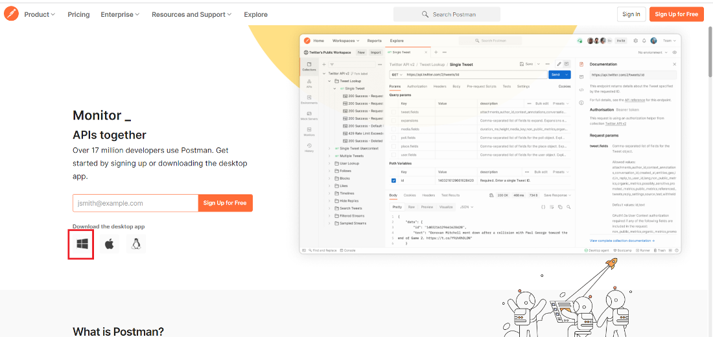
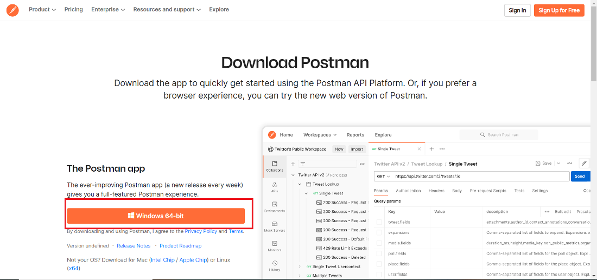
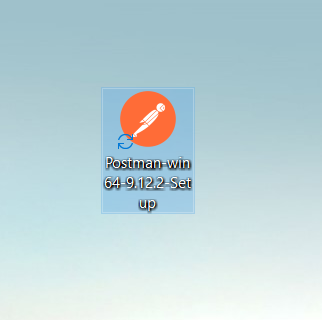
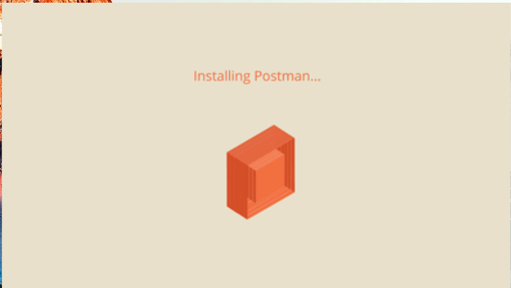
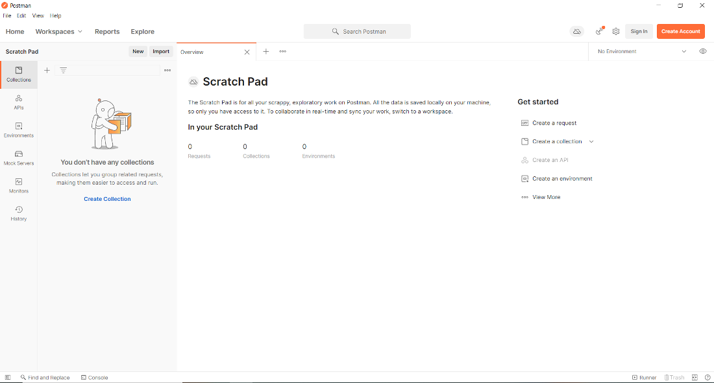
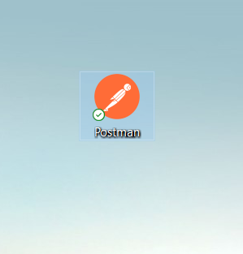

Introduction to Testing Methodologies:
    
Research and understand the concepts of unit testing and integration testing in software development.

    . Introduction to Testing Methodologies

    •	Unit Testing:
        o	Definition: 
            Unit testing involves testing individual components or functions in isolation to ensure they work as expected.
        o	Purpose: 
            It focuses on the smallest testable parts of the application to verify their correctness.
        o	Tools:
            Common tools for unit testing include Jest, Mocha, JUnit, etc.

    •	Integration Testing:
        o	Definition:
             Integration testing examines the interactions between different modules or services to ensure they work together correctly.
        o	Purpose:
             It ensures that combined components or systems work as intended when integrated.
        o	Tools:
             Tools like Supertest for Node.js, Postman for API testing, etc.

Explore the importance of testing in ensuring the functionality, reliability, and performance of applications.

    •	Importance of Testing:
        o	Functionality: Testing ensures that all parts of the application function as expected.
        o	Reliability: It helps in identifying and fixing bugs before they reach production.
        o	Performance: Regular testing can uncover performance bottlenecks and areas for optimization.

Testing Backend API Endpoints using Postman:
    Install and set up Postman for testing backend API endpoints.

        Installing Postman on Windows
        Follow the below steps to install Postman on Windows:

        Step 1: Visit the https://www.postman.com/ website using any web browser. 

        Step 2: Click on Windows Button to download.

    

        Step 3: Now click on Windows 64 – bit button.

        Step 4: Now check for the executable file in downloads in your system and run it.
        

        Step 5: Now installing process will start it takes a minute to install in the system.

        Step 6: After installing the program the software opens automatically. Now you can see the interface of the software.

        Postman is successfully installed on the system and an icon is created on the desktop.

Create collections and requests in Postman to test various API endpoints of your expense tracking application

Test CRUD operations, authentication, and error handling functionalities of the backend API.

    CREATE
    Inorder to test CREATE operation we will attempt to add a new expense to the expenses table in the expense tracker database
    we will use the POST request for this

    
    READ
    For READ operation we will try to view all existing expenses in the expense table of the expense tracker database. Here we will use the GET request

    UPDATE
    Inorder to test the UPDATE operation we will attempt to change the details of an existing user. We will use PUT request to fulfil this

    DELETE
    Inorder to test the DELETE operation we will attempt to delete an already existing user from the users table in the expense traker database.

    Authentication
    Inorder to test Authentication we will use the login and registration routes coupled with the POST request.

    We will first create a new user named "trialname" then try to login using their credentials.

    then we will use the same credentials to log into the system

    to test constraint on input fields we attempt to create a new user with a missing field. it will prompt the user to input all the fields.

    also we attempt to create a user with an already used email or username. the system returns an error message as well. 

    when a user attempts to log into the system using wrong credentials the system produces an error message.

